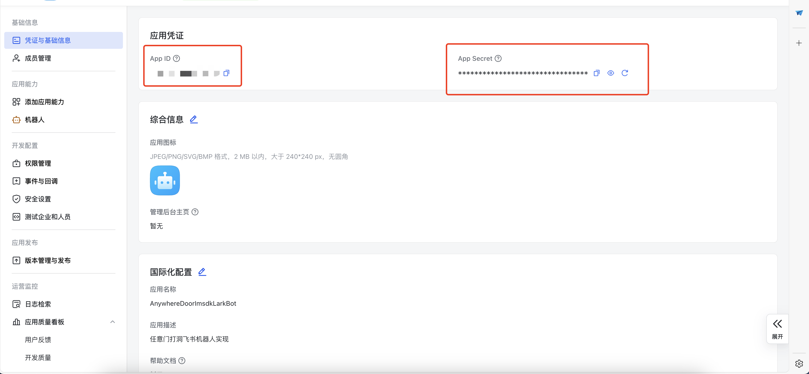
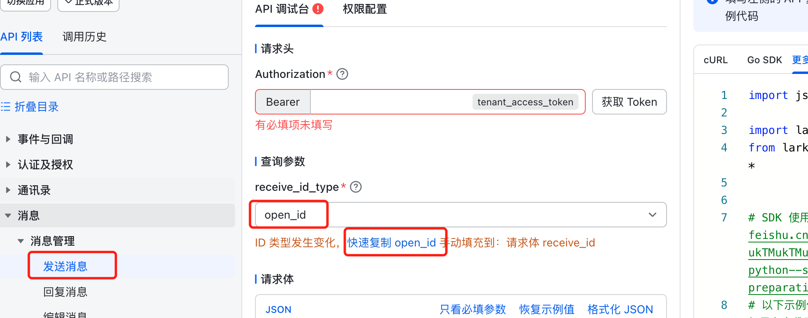

# AnywhereDoorImsdkLarkBot
* imsdk 飞书机器人实现

## 使用方式
* 保证容器正常运行即可

## 飞书参数获取:
* 参考文档: https://open.feishu.cn/document/uAjLw4CM/uMzNwEjLzcDMx4yM3ATM/develop-an-echo-bot/introduction


### APP_ID & APP_SECRET
* 地址: https://open.feishu.cn/app/cli_a709fa1dab37d013/baseinfo


### OPEN_ID
* 地址: https://open.feishu.cn/api-explorer?apiName=create&project=im&resource=message&version=v1


## 环境变量
* HOST: 控制平面地址
* PORT: 控制平面端口
* PREFIX: 控制平面前缀
* USERNAME: imsdk所属用户名称
* TOKEN: imsdk令牌
* IMSDK_NAME: imsdk名称
* APP_ID: 从飞书开发者平台获取
* APP_SECRET: 从飞书开发者平台获取
* OPEN_ID: 从飞书开发者平台获取

## 打包方式
1. 将代码clone下来
2. 安装docker及buildx
3. 打包镜像
   * `docker buildx build --platform linux/amd64 -t 192.168.25.5:31100/maoyanluo/anywhere-door-imsdk-larkbot:1.0 . --load`

## 部署方式

### Docker Command Line
1. 运行容器
   * `docker run --name anywhere-door-imsdk-larkbot -itd -p 8082:80 -e HOST=ip -e PORT=port -e USERNAME=username -e TOKEN=token -e IMSDK_NAME=larkbot -e APP_ID=appid -e APP_SECRET=appsecret -e OPEN_ID=openid --restart=always 192.168.25.5:31100/maoyanluo/anywhere-door-imsdk-larkbot:1.0`

### Kubernetes
```yaml
---
apiVersion: apps/v1
kind: Deployment
metadata:
  name: anywhere-door-imsdk-larkbot-deployment
  namespace: anywhere-door
spec:
  replicas: 1
  selector:
    matchLabels:
      app: anywhere-door-imsdk-larkbot
  template:
    metadata:
      labels:
        app: anywhere-door-imsdk-larkbot
    spec:
      containers:
      - name: anywhere-door-imsdk-larkbot
        image: 192.168.25.5:31100/maoyanluo/anywhere-door-imsdk-larkbot:1.0
        imagePullPolicy: IfNotPresent
        env:
        - name: HOST
          value: "anywhere-door-control-plane-service.anywhere-door"
        - name: PORT
          value: "80"
        - name: USERNAME
          value: maoyanluo
        - name: TOKEN
          value: "token"
        - name: IMSDK_NAME
          value: "larkbot"
        - name: APP_ID
          value: "appid"
        - name: APP_SECRET
          value: "appsecret"
        - name: OPEN_ID
          value: "openid"
        ports:
        - containerPort: 80
      restartPolicy: Always
---
apiVersion: v1
kind: Service
metadata:
  name: anywhere-door-imsdk-larkbot-service
  namespace: anywhere-door
  labels:
    app: anywhere-door-imsdk-larkbot
spec:
  type: ClusterIP
  ports:
  - port: 80
    targetPort: 80
  selector:
    app: anywhere-door-imsdk-larkbot
```

## 使用方式
1. 保证容器正常运行, 并且启动后, 扫码登录成功
2. 注册imsdk: POST AnywhereDoorManager/imsdk/create & Header: token: token & Body: { "imsdk_name": "name", "imsdk_describe": "desc", "imsdk_host": "anywhere-door-imsdk-larkbot-service.anywhere-door", "imsdk_port": 80, "imsdk_token": "token" }